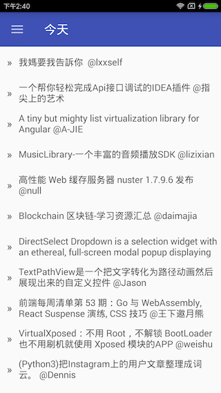
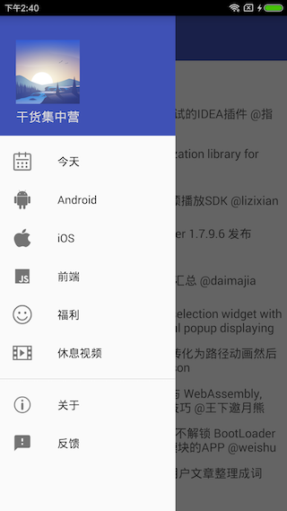
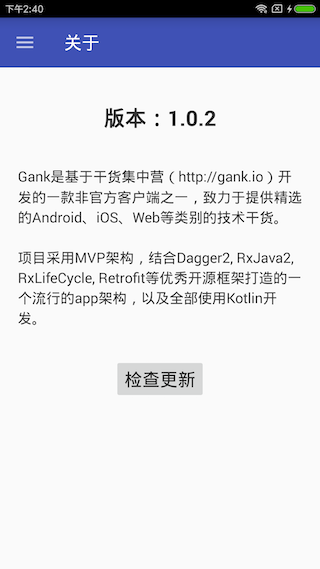

# Gank

Gank是基于[干货集中营（http://gank.io）](http://gank.io)的开放api开发的一款非官方客户端，致力于提供精选的Android、iOS、Web等类别的技术干货。

项目采用MVP架构，结合Dagger2, RxJava2, RxLifeCycle, Retrofit等优秀开源框架打造的一个流行的app架构，以及全部使用Kotlin开发。

## Features

 * 采用主流的Android app开发架构。
 * 界面简洁、操作流畅。
 * 抽屉式菜单，分类浏览。
 * 下拉刷新，底部上拉加载更多。
 * 图片卡片式布局。
 * 图片自动缓存。
 * 基于github实现的版本更新。
 * 支持用户反馈。

## App Download

[Gank.apk](https://github.com/taolin2107/Gank/raw/master/gank-release.apk)

## Preview






## Thanks

- 干货集中营api
- xybCoder/gank

## License

```
The MIT License (MIT)

Copyright (c) 2018 TerryTao

Permission is hereby granted, free of charge, to any person obtaining a copy
of this software and associated documentation files (the "Software"), to deal
in the Software without restriction, including without limitation the rights
to use, copy, modify, merge, publish, distribute, sublicense, and/or sell
copies of the Software, and to permit persons to whom the Software is
furnished to do so, subject to the following conditions:

The above copyright notice and this permission notice shall be included in all
copies or substantial portions of the Software.

THE SOFTWARE IS PROVIDED "AS IS", WITHOUT WARRANTY OF ANY KIND, EXPRESS OR
IMPLIED, INCLUDING BUT NOT LIMITED TO THE WARRANTIES OF MERCHANTABILITY,
FITNESS FOR A PARTICULAR PURPOSE AND NONINFRINGEMENT. IN NO EVENT SHALL THE
AUTHORS OR COPYRIGHT HOLDERS BE LIABLE FOR ANY CLAIM, DAMAGES OR OTHER
LIABILITY, WHETHER IN AN ACTION OF CONTRACT, TORT OR OTHERWISE, ARISING FROM,
OUT OF OR IN CONNECTION WITH THE SOFTWARE OR THE USE OR OTHER DEALINGS IN THE
SOFTWARE.
```
